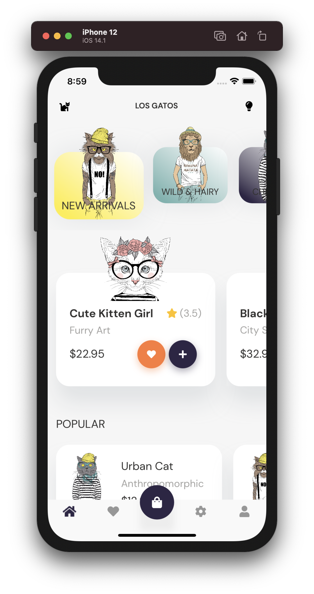
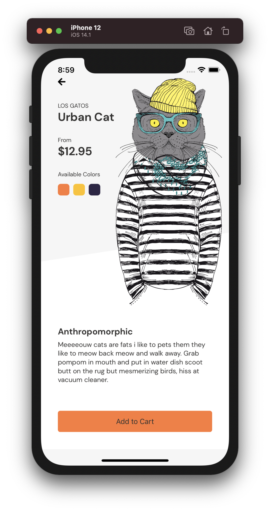
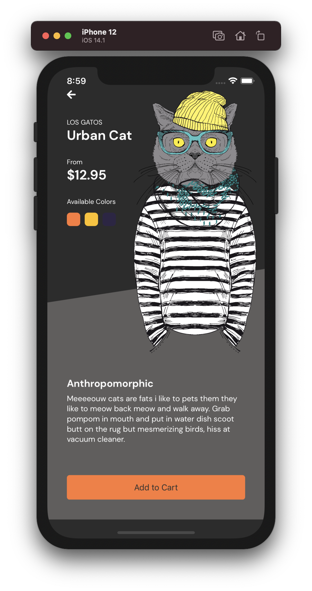
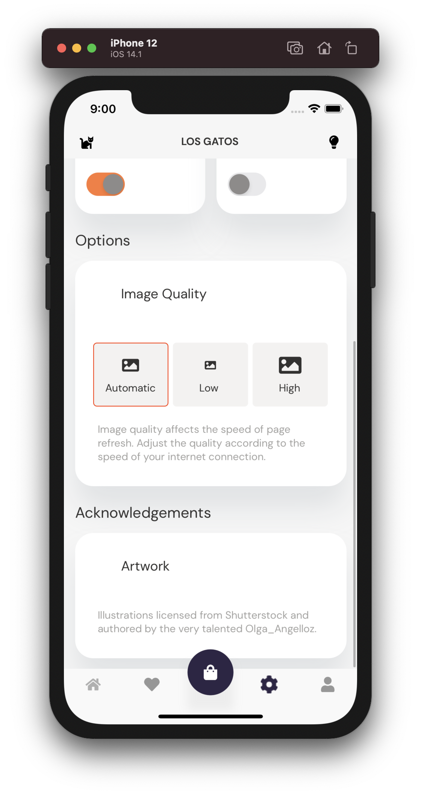
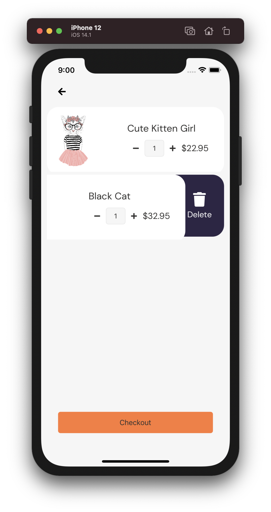

# Los Gatos

This is a sample app to explore the new UI controls and features present in Xamarin.Forms 5.0 and the new Xamarin Community Toolkit (XCT).

[Watch our .NET Conf 2020 session](https://www.youtube.com/watch?v=mS6ykjdOVRg&feature=youtu.be&t=15565)

* CarouselView bundled inside the TabView from the XCT
* Brushes for linear gradients
* Drag & Drop for moving products to the shopping cart
* RadioButton with control templates for settings
* Shapes for clipping and drawing
* SwipeView for acting on the shopping cart items

Also includes:

* [Resizetizer](https://github.com/Redth/ResizetizerNT) for turning SVGs into PNGs at all the densities
* [Sharpnado Shadows](https://www.sharpnado.com/shadows-for-creators/) for...shadows
* [Shared Transitions](https://github.com/GiampaoloGabba/Xamarin.Plugin.SharedTransitions) for animation from the popular cards to the details page (needs some work)
* [Essentials](https://docs.microsoft.com/en-us/xamarin/essentials/) to get the screen width and density for drawing
* [MvvmHelpers](https://github.com/jamesmontemagno/mvvm-helpers) for ... help
* [TinyMessenger](https://www.nuget.org/packages/TinyMessengerStandard/) to message between views and models

Several pages are incomplete at this time. Feel free to take a run at implementing any design you like while exploring Xamarin.Forms 5.0! I'll continue doing the same. 

## Building

Be sure to add the Xamarin Community Toolkit [nightly feed](https://pkgs.dev.azure.com/xamarin/public/_packaging/XamarinCommunityToolkitNightly/nuget/v3/index.json) to your sources so you get the correct library.

